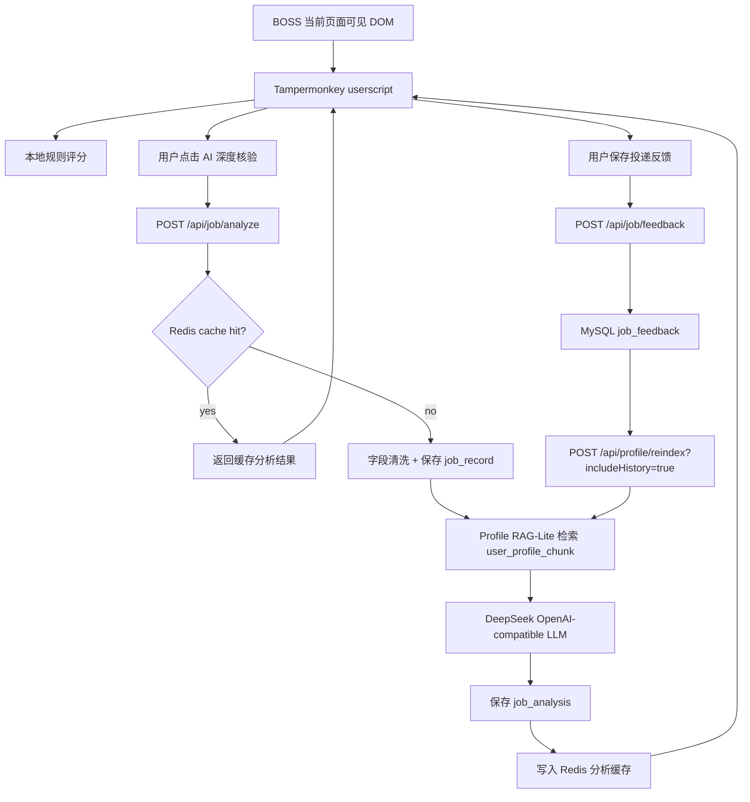

# AI Job Screening Agent / BOSS 求职 Agent

面向 Java 后端 / AI 应用开发实习求职场景的用户画像驱动岗位筛选 Agent。

本项目把浏览器页面可见岗位信息、本地规则评分、AI 深度核验、MySQL 记录、Redis 缓存、用户画像配置和 RAG-Lite 检索串成一条个人求职跟进链路。它的目标不是替用户操作招聘平台，而是帮助用户更稳定地判断岗位是否值得投、为什么值得投、后续如何跟进。

## Features

- BOSS 页面规则评分：userscript 只读取当前页面可见 DOM 文本，在页面右下角展示岗位匹配度。
- AI 深度核验：用户主动点击后，请求本地 Spring Boot 后端做进一步分析。
- DeepSeek 分析：后端通过 OpenAI-compatible 接口调用 DeepSeek，返回结构化结论。
- Redis 缓存去重：相同岗位和同一用户画像版本下复用分析结果。
- MySQL 落库：保存岗位记录、AI 分析结果和投递反馈。
- 投递反馈闭环：保存投递、沟通、面试和放弃原因。
- 用户画像 scoring config：后端根据用户画像生成并确认个性化评分配置。
- Profile RAG-Lite：将用户画像、历史分析和反馈整理为 chunk，用关键词检索增强 AI Prompt。
- profileRag 命中证据：AI 分析结果返回画像命中资料，便于解释分析依据。
- 历史记录查询：支持最近记录、详情、搜索和相似岗位匹配。
- 字段清洗与历史匹配优化：降低脏 companyName、长 JD 片段对历史记录和 RAG chunk 的影响。

## Architecture



## Quick Start

### 1. Prepare MySQL

```sql
CREATE DATABASE IF NOT EXISTS ai_job_agent
  DEFAULT CHARACTER SET utf8mb4
  DEFAULT COLLATE utf8mb4_unicode_ci;
```

Then run:

```text
backend/src/main/resources/schema.sql
```

### 2. Prepare Redis

```bash
docker run -d --name ai-job-agent-redis -p 6379:6379 redis:7-alpine
```

If a local Redis instance is already available on `localhost:6379`, it can be reused.

### 3. Configure Environment Variables

Copy `.env.example` locally or configure these variables in your shell:

- `DEEPSEEK_API_KEY`
- `MYSQL_URL`
- `MYSQL_USERNAME`
- `MYSQL_PASSWORD`
- `REDIS_HOST`
- `REDIS_PORT`
- `REDIS_PASSWORD`

Do not commit real API keys, passwords, or `.env` files.

### 4. Start Backend

```bash
cd backend
mvn spring-boot:run
```

Health check:

```bash
curl http://localhost:8080/api/health
```

### 5. Install Userscript

1. Install Tampermonkey.
2. Create a new userscript.
3. Paste `userscripts/job-chat-status-export.user.js`.
4. Save and open a BOSS job page.
5. The job fit panel appears at the bottom right.

## Main Workflow

1. Open a job detail page.
2. Review local rule scoring and field extraction sources.
3. Click AI 深度核验.
4. Review DeepSeek result, profileRag evidence, and history records.
5. Decide manually whether to apply.
6. Save application feedback.
7. Run `POST /api/profile/reindex?includeHistory=true` when you want historical analysis and feedback to enter RAG-Lite.

## Documentation

- [Architecture](docs/architecture.md)
- [API Reference](docs/api_reference.md)
- [Demo Walkthrough](docs/demo_walkthrough.md)
- [Privacy & Compliance](docs/privacy_and_compliance.md)
- [Roadmap](docs/roadmap.md)

## Compliance Boundary

This project is a local-first personal job-search tracking and analysis tool.

- It only reads DOM text already visible on the current browser page.
- It does not read BOSS Cookie / Token.
- It does not access BOSS non-public APIs.
- It does not bypass verification or login checks.
- It does not apply to jobs automatically.
- It does not send messages automatically.
- It does not perform platform data collection.
- AI analysis is advisory; the final decision is made manually by the user.

## Current Limitations

- Single-user `default` profile only.
- RAG-Lite uses keyword retrieval, not embedding.
- No PDF resume upload or parsing.
- No Redis Vector, Milvus, or rerank.
- Salary, company name, city, schedule, and duration extraction may need maintenance if page structure changes.
- The local rule score is heuristic and should be reviewed manually.

## Directory Structure

```text
ai-job-application-tracker-toolkit/
├─ backend/                 Spring Boot backend
├─ userscripts/             Tampermonkey userscript
├─ docs/                    Public project documentation
├─ prompts/                 Prompt templates
├─ templates/               Excel templates
├─ examples/                Mock example data
├─ .env.example             Environment variable template
└─ README.md
```

## Repository Description

A profile-driven AI job screening agent for Java backend and AI application internship tracking, with local userscript scoring, Spring Boot backend, DeepSeek analysis, MySQL persistence, Redis cache, and RAG-Lite profile evidence.
