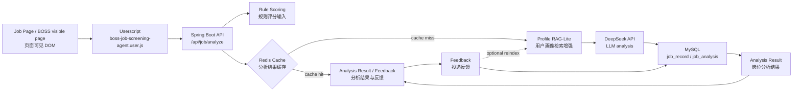

# AI Job Screening Agent（智能岗位筛选 Agent）

## Overview（项目简介）

AI Job Screening Agent 是一个面向求职场景的 local-first AI 岗位筛选辅助工具，定位是 Java 后端 / AI 应用开发实习方向的个人项目展示。它帮助用户在主动浏览岗位时，把页面可见岗位信息、规则评分、LLM 分析、用户画像证据和后续投递反馈串成一个可追踪的分析流程。

浏览器侧通过 Userscript 读取招聘页面当前可见 DOM 中的岗位信息，并在页面内展示岗位匹配度面板。后端基于 Spring Boot，结合 rule-based scoring、DeepSeek API、Profile RAG-Lite、Redis cache 和 MySQL persistence，生成岗位匹配分析、风险点、简历匹配点、面试准备方向和投递建议。

本项目是个人辅助工具，不是爬虫系统；不自动投递，不自动发送消息，不绕过招聘平台限制，也不访问平台非公开 API。所有岗位判断结果仅作为个人求职决策参考。

## Features（核心功能）

- Job information extraction（岗位信息提取）：Userscript 从当前页面可见 DOM 中提取 jobTitle、companyName、salary、city、schedule、duration 和 JD 文本。
- Rule-based scoring（规则评分）：浏览器侧先做本地规则评分，用于快速初筛岗位方向、技术栈和风险点。
- LLM analysis with DeepSeek（DeepSeek 大模型分析）：用户主动点击后，请求 Spring Boot 后端调用 DeepSeek OpenAI-compatible API 生成结构化分析。
- Profile RAG-Lite（用户画像检索增强）：后端将用户画像与可选历史反馈整理为 chunk，用关键词检索命中证据增强 AI Prompt。
- Redis cache（分析结果缓存）：同一岗位与同一 profileVersion 下复用分析结果，减少重复 LLM 调用。
- MySQL persistence（历史记录持久化）：保存岗位记录、AI 分析结果、用户画像、RAG-Lite chunk 和投递反馈。
- Feedback loop（投递反馈闭环）：保存投递状态、沟通状态、面试状态、备注和拒绝原因，可在 reindex 时进入 RAG-Lite。
- Userscript integration（浏览器脚本集成）：在 BOSS 直聘页面内展示评分、AI 分析结果、历史记录和反馈表单。

## Architecture（系统架构）



## Tool Calling Design（工具调用设计）

本项目中的 Tool Calling 是轻量 Tool Calling 风格，不是复杂多 Agent 编排。它将岗位查询、用户画像查询、历史记录查询等后端业务能力封装为 AI 分析流程可调用的工具能力，用于说明后端能力如何服务 LLM 分析流程。

当前代码中主要体现为 Spring Boot service/repository/controller 能力组合：岗位分析流程会读取岗位输入、查询 Profile RAG-Lite chunk、查询历史记录、保存分析结果和反馈。它没有实现模型自主规划多步骤任务，也没有实现复杂多 Agent 协作。

| Tool | Description |
|---|---|
| jobQueryTool | 查询岗位记录和岗位详情 |
| profileQueryTool | 查询用户画像和 RAG-Lite 命中证据 |
| historyQueryTool | 查询历史分析记录和投递反馈 |
| feedbackTool | 保存用户反馈，辅助后续岗位分析 |

Example Tool Call:

```json
{
  "tool": "profileQueryTool",
  "arguments": {
    "profileName": "default",
    "query": "Java backend Spring Boot Redis AI application internship",
    "topK": 5
  }
}
```

Example Tool Result:

```json
{
  "enabled": true,
  "profileName": "default",
  "chunkCount": 2,
  "chunks": [
    {
      "id": 12,
      "title": "Skills",
      "content": "Java, Spring Boot, MySQL, Redis, RAG-Lite, Tool Calling",
      "score": 8,
      "sourceType": "manual_profile"
    },
    {
      "id": 18,
      "title": "Project Experience",
      "content": "Built a Spring Boot backend with Redis cache and MySQL persistence.",
      "score": 5,
      "sourceType": "manual_profile"
    }
  ]
}
```

当前记录核心分析日志与业务结果，后续可扩展 `tool_call_log` 表以追踪更细粒度的工具调用过程。

## RAG-Lite Design（RAG-Lite 设计）

当前 RAG-Lite 是基于用户画像的轻量检索增强。用户画像、技能、项目经历、偏好关键词，以及可选的历史分析和投递反馈会被整理到 `user_profile_document` 和 `user_profile_chunk` 中。岗位分析时，后端根据岗位标题、城市、出勤周期、规则分数、规则结论和 JD 文本构造 query，并用关键词命中方式检索 topK chunk。

这不是向量数据库方案。当前版本没有使用 Milvus、Chroma、Redis Vector、Embedding rerank 等生产级 RAG 组件。选择 RAG-Lite 的原因是用户画像数据规模小、字段结构清晰、可解释性强，并且实现轻量，适合作为个人求职辅助工具的第一版。

后续如果用户画像、历史记录和简历材料规模明显变大，可以升级为 Embedding + Vector Store + Rerank，并保留当前关键词命中结果作为可解释 fallback。

## Quick Start（快速启动）

1. Clone repository（克隆仓库）

```bash
git clone <your-repo-url>/ai-job-screening-agent.git
cd ai-job-screening-agent
```

2. Start MySQL and Redis with Docker Compose（启动依赖环境）

```bash
docker compose up -d
```

3. Configure environment variables（配置环境变量）

```bash
cp .env.example .env
```

编辑本机环境变量或 `.env`，填入自己的 `DEEPSEEK_API_KEY`。不要提交真实 API Key、密码、Cookie 或 Token。

4. Initialize database schema（初始化数据库）

```bash
mysql -h 127.0.0.1 -P 3306 -u root -proot ai_job_agent < backend/src/main/resources/schema.sql
```

5. Start Spring Boot backend（启动后端）

```bash
cd backend
mvn spring-boot:run
```

Health check:

```bash
curl http://localhost:8080/api/health
```

6. Install userscript（安装浏览器脚本）

将 `userscripts/boss-job-screening-agent.user.js` 安装到 Tampermonkey 或兼容的 Userscript 管理器。

7. Open supported job page and run analysis（打开岗位页面并运行分析）

打开支持的 BOSS 岗位页面，查看右下角岗位评分面板。需要 AI 深度分析时，手动点击面板中的 AI 分析按钮；分析结果会通过本地后端写入 MySQL，并按配置写入 Redis cache。

## API Overview（接口概览）

- `GET /api/health`：健康检查。
- `POST /api/job/analyze`：保存岗位记录，检索 Profile RAG-Lite，调用 DeepSeek 或 fallback，并保存分析结果。
- `GET /api/jobs/recent`：查询最近岗位分析记录。
- `GET /api/jobs/{jobRecordId}`：查询单条岗位记录详情。
- `GET /api/jobs/search`：按关键词搜索历史岗位记录。
- `GET /api/jobs/match`：按当前岗位信息匹配历史记录。
- `POST /api/job/feedback`：保存投递反馈。
- `GET /api/job/feedback`：查询某岗位的反馈列表。
- `POST /api/profile/manual`：保存默认用户画像。
- `GET /api/profile/current`：查询当前用户画像。
- `POST /api/profile/reindex`：重建 RAG-Lite document/chunk。
- `GET /api/profile/search`：搜索 Profile RAG-Lite chunk。
- `GET /api/profile/scoring-config`：读取用户评分配置。
- `POST /api/profile/generate-scoring-config`：基于用户画像生成评分配置。
- `POST /api/profile/scoring-config/confirm`：确认评分配置。

更多示例见 [API Reference（接口文档）](docs/api_reference.md)。

## Screenshots / Demo（截图与演示）

Screenshots will be added later. 当前仓库没有可引用的截图或 `demo.gif`，因此 README 不放置不存在的图片链接。建议补充内容见 [docs/screenshots/README.md](docs/screenshots/README.md)。

## Compliance Boundary（合规边界）

- 只读取当前页面可见 DOM 文本。
- 不读取 Cookie / Token。
- 不访问招聘平台非公开 API。
- 不自动投递。
- 不自动发送消息。
- 不绕过验证码或反爬机制。
- 不做批量爬取。
- 不采集非当前用户主动查看的信息。
- AI 分析仅作个人辅助判断，最终投递决策由用户手动完成。

## Roadmap（后续规划）

- More structured feedback loop（更结构化的反馈闭环）：沉淀投递结果、拒绝原因和面试反馈。
- Better profile management（更完善的用户画像管理）：支持更清晰的 profile 编辑和版本说明。
- Optional embedding-based retrieval（可选向量检索）：在数据规模变大后引入 Embedding + Vector Store + Rerank。
- More detailed tool call logging（更细粒度工具调用日志）：扩展 `tool_call_log` 记录分析流程中的工具输入输出。
- Basic dashboard or screenshots（基础看板或截图）：补充岗位评分面板、AI 分析结果和历史记录页面截图。

## Documentation（项目文档）

- [Architecture（系统架构）](docs/architecture.md)
- [API Reference（接口文档）](docs/api_reference.md)
- [Demo Walkthrough（演示流程）](docs/demo_walkthrough.md)
- [Privacy & Compliance（隐私与合规）](docs/privacy_and_compliance.md)
- [Roadmap（后续规划）](docs/roadmap.md)

## Directory Structure（目录结构）

```text
ai-job-screening-agent/
|-- backend/                 Spring Boot backend
|-- userscripts/             Userscript integration
|-- docs/                    Project documentation
|-- docker-compose.yml       Local MySQL and Redis dependencies
|-- .env.example             Environment variable template
|-- LICENSE
`-- README.md
```

## Repository Description（仓库描述）

Local-first, compliance-aware, Java backend powered lightweight AI job screening agent with Userscript integration, rule scoring, DeepSeek analysis, Redis cache, MySQL persistence, and Profile RAG-Lite.
