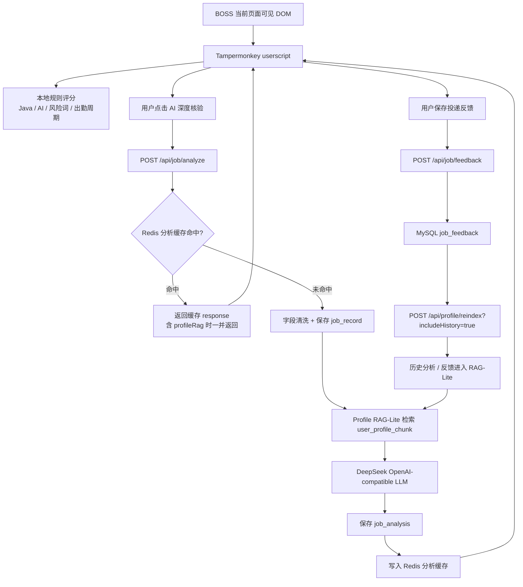

# AI Job Screening Agent / BOSS 求职 Agent

面向 Java 后端 / AI 应用开发实习求职场景的用户画像驱动岗位筛选 Agent。

这个项目把 BOSS 页面可见岗位信息、本地规则评分、AI 深度核验、MySQL 记录、Redis 缓存、用户画像配置和 RAG-Lite 检索串成一条个人求职跟进链路。它的目标不是替用户自动操作平台，而是帮助用户更稳定地判断岗位是否值得投、为什么值得投、后续怎么跟进。

## 核心功能

- BOSS 页面规则评分：用户脚本只读取当前页面可见 DOM 文本，在右下角展示岗位匹配度。
- AI 深度核验：用户主动点击后，请求本地 Spring Boot 后端做进一步分析。
- DeepSeek 分析：后端通过 OpenAI-compatible 接口调用 DeepSeek，返回结构化结论。
- Redis 缓存去重：相同岗位和同一画像版本下复用分析结果，避免重复请求。
- MySQL 落库：保存 job_record、job_analysis、job_feedback 等长期记录。
- 投递反馈闭环：在页面中保存投递、沟通、面试和放弃原因。
- 用户画像 scoring config：后端根据默认用户画像生成并确认个性化评分配置。
- Profile RAG-Lite：把用户画像、历史分析和投递反馈切成 chunk，用关键词检索增强 AI Prompt。
- profileRag 命中证据：AI 分析结果返回并在前端展示画像命中来源。
- 历史记录查询：前端可查看最近岗位分析记录，后端提供历史查询接口。
- 历史反馈反哺 RAG：reindex 时可把历史分析和反馈加入用户画像检索资料。
- 字段清洗和历史匹配优化：降低脏 companyName、长 JD 片段对历史匹配和 RAG chunk 的影响。

## 架构图



## 快速启动

### 1. 准备 MySQL

创建数据库：

```sql
CREATE DATABASE IF NOT EXISTS ai_job_agent
  DEFAULT CHARACTER SET utf8mb4
  DEFAULT COLLATE utf8mb4_unicode_ci;
```

执行建表脚本：

```text
backend/src/main/resources/schema.sql
```

### 2. 准备 Redis

如果本地没有 Redis，可以用 Docker 启动：

```bash
docker run -d --name ai-job-agent-redis -p 6379:6379 redis:7-alpine
```

如果本地已有 Redis，只要 `localhost:6379` 可用即可。

### 3. 配置环境变量

```bash
DEEPSEEK_API_KEY=你的 DeepSeek API Key
MYSQL_URL=jdbc:mysql://localhost:3306/ai_job_agent?useUnicode=true&characterEncoding=utf8&serverTimezone=Asia/Shanghai&allowPublicKeyRetrieval=true&useSSL=false
MYSQL_USERNAME=root
MYSQL_PASSWORD=你的 MySQL 密码
REDIS_HOST=localhost
REDIS_PORT=6379
```

不要把真实 API Key 或数据库密码提交到 GitHub。

### 4. 启动后端

```bash
cd backend
mvn spring-boot:run
```

健康检查：

```bash
curl http://localhost:8080/api/health
```

### 5. 安装 userscript

1. 安装 Tampermonkey。
2. 新建用户脚本。
3. 粘贴 `userscripts/job-chat-status-export.user.js`。
4. 保存后打开 BOSS 岗位页面。
5. 右下角会出现岗位匹配度面板。

## 典型使用流程

1. 打开 BOSS 岗位详情页。
2. 查看右下角本地规则评分和字段来源。
3. 点击“AI 深度核验”。
4. 查看 DeepSeek 分析、profileRag 画像命中证据和历史记录。
5. 根据人工判断决定是否投递。
6. 保存投递反馈。
7. 定期执行 `POST /api/profile/reindex?includeHistory=true`，让历史分析和反馈进入 RAG-Lite。

## 合规边界

本项目只用于个人求职过程中的本地记录、页面可见信息整理和 AI 辅助分析。

- 只读取当前浏览器页面已经展示的 DOM 文本。
- 不读取 BOSS Cookie / Token。
- 不访问 BOSS 非公开接口。
- 不绕过验证码或登录校验。
- 不自动投递。
- 不自动发送消息。
- 不进行平台数据采集。
- AI 分析只作为辅助建议，最终是否投递由用户人工决定。

## 当前限制

- 当前是单用户 `default` 画像，没有做多用户登录。
- RAG-Lite 使用关键词检索，不是 embedding，也没有向量数据库。
- 没有 PDF 简历上传和解析。
- 没有 Redis Vector / Milvus / Rerank。
- 薪资、公司名、城市等字段仍依赖页面结构，页面改版时可能需要调整抽取规则。
- userscript 中的本地规则评分是启发式判断，不保证完全准确。

## 后续规划

- 手动画像编辑页。
- PDF 简历解析和结构化画像补全。
- embedding 检索与更稳定的召回排序。
- 面试复盘进入 RAG-Lite。
- Dashboard：投递数、回复率、约面率、拒绝原因和方向分布。
- 多用户配置与更细的权限隔离。

## 目录结构

```text
ai-job-application-tracker-toolkit/
├─ backend/                 Spring Boot 后端
├─ userscripts/             Tampermonkey 用户脚本
├─ docs/                    架构、API、演示和设计文档
├─ prompts/                 求职分析提示词
├─ templates/               Excel 模板
├─ examples/                mock 示例数据
└─ README.md
```

## 推荐仓库描述

A profile-driven AI job screening agent for Java backend and AI application internship tracking, with local userscript scoring, Spring Boot backend, DeepSeek analysis, MySQL persistence, Redis cache, and RAG-Lite profile evidence.
