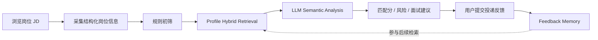
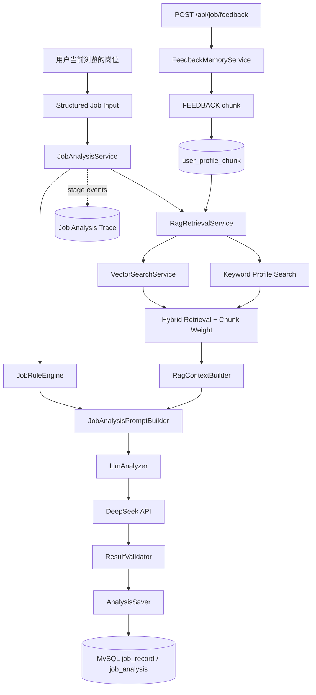
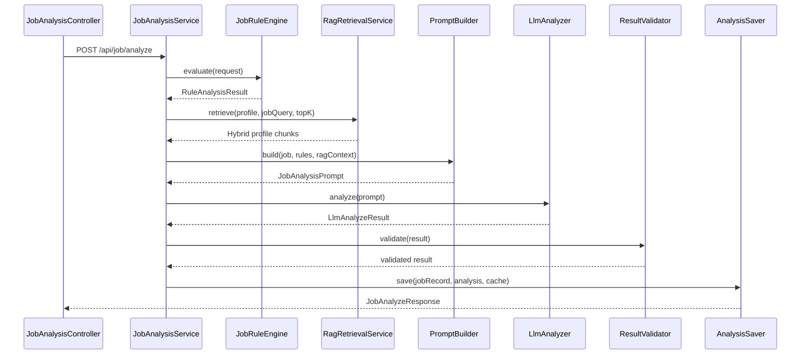
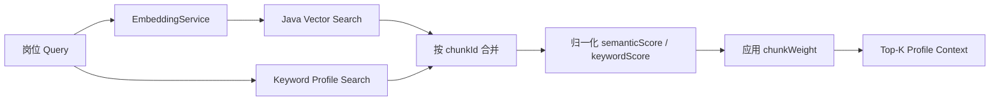
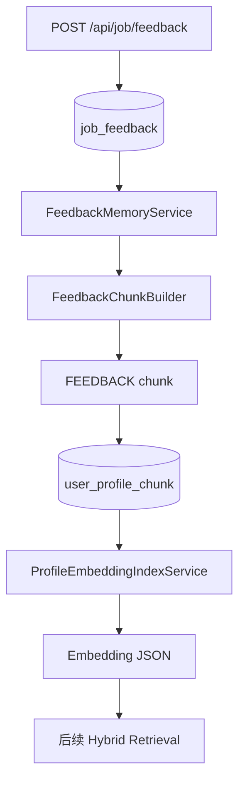
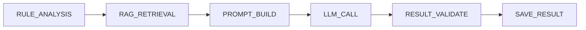

# AI Job Screening Agent

基于 RAG + LLM Agent 的智能岗位分析与求职辅助系统。

> **一句话介绍：** 基于 Java Spring Boot + RAG + LLM Agent 的智能岗位分析与求职辅助系统，将 Rule Engine、Profile RAG、LLM Semantic Analysis、Feedback Memory 和 Trace 组合成一条可解释的 AI 应用链路。

这是一个以 Java / Spring Boot 为核心的 AI 应用工程项目：系统接收用户当前浏览的岗位信息，先用确定性规则完成硬约束初筛，再从用户画像和历史反馈 Memory 中检索证据，构建受约束的 LLM 分析请求，校验结构化结果并保存完整分析 Trace。

项目重点不是“调用一次大模型 API”，而是围绕岗位分析场景构建可解释、可降级、可追踪的 Agent 应用链路。

### 为什么不是直接调用 LLM

纯 LLM 方案很难稳定支撑岗位匹配：

- 模型可能根据岗位描述臆测用户没有做过的项目或技能；
- 结论缺少可追溯的匹配证据；
- 学历、城市、出勤和实习周期等硬约束不适合交给模型自由判断；
- 投递和面试反馈只是数据库历史记录，无法自动成为后续分析上下文。

当前实现将职责拆开：规则层控制确定性约束，RAG 层提供用户真实证据，Prompt 层限制模型边界，LLM 负责语义解释，Validator 保证输出可用，Trace 记录每个阶段，Feedback Memory 再将用户行为反馈接回画像检索。

## 项目简介

招聘 JD 通常存在以下问题：

- 信息量大，岗位职责和任职要求混在长文本中；
- 技术要求表达不统一，同一能力可能使用不同术语；
- 人工逐项对照简历和项目经历成本高；
- 投递、沟通、面试反馈容易散落，无法形成后续分析依据。

系统将岗位输入、用户画像、RAG 证据、规则判断、LLM 分析和反馈记忆串成一个闭环：

```text
岗位 JD
  ↓
结构化岗位信息
  ↓
规则初筛
  ↓
用户 Profile RAG / Feedback Memory
  ↓
受约束 Prompt
  ↓
DeepSeek 结构化分析
  ↓
结果校验与持久化
  ↓
Trace 与投递反馈
```

当前后端已经包含：

- Spring Boot 岗位分析接口；
- MySQL 岗位、分析结果、用户画像和反馈存储；
- Redis 分析结果缓存；
- PDFBox 简历解析与 LLM 结构化；
- DashScope `text-embedding-v4` Embedding；
- Java 内存余弦相似度 + 关键词的 Hybrid Retrieval；
- Profile Chunk Weight 排序；
- Feedback Memory Chunk；
- Job Analysis Trace。

## 真实使用场景

用户在招聘平台主动打开一个岗位详情页，浏览器侧采集岗位标题、公司、薪资、城市、学历、技能标签和完整 JD。用户点击分析后，后端先执行规则初筛，再根据岗位语义检索用户的技能、项目和经历证据，最后生成结构化投递建议。



这个流程服务的是“当前岗位是否值得投、依据是什么、还需要准备什么”，不是自动投递或批量爬取系统。

## Demo Output

下面是当前分析接口的简化输出示例，字段与实际 `JobAnalyzeResponse` 保持一致：

```json
{
  "decision": "优先投",
  "score": 95,
  "resumeMatches": [
    "AI求职Agent项目",
    "RAG应用开发经验",
    "Java Spring Boot后端经验"
  ],
  "risks": [
    "需要深入Spring Boot原理"
  ]
}
```

完整响应还会返回 `taskId`、`jobRecordId`、`profileRag` 和召回 Chunk 的 `semanticScore`、`keywordScore`、`chunkWeight`、`finalScore`，用于结果解释和 Trace 关联。

## 系统整体架构



岗位分析主流程由后端固定编排，LLM 负责语义分析，规则、检索、校验和持久化由业务代码控制。这种设计保留了 Agent 的灵活分析能力，同时避免让模型直接决定数据库写入或硬约束结论。

## Agent Workflow

一次岗位分析从 `JobAnalysisService.analyze()` 开始，当前流程如下：

当前采用 **Workflow Agent** 架构：后端负责流程编排、状态控制、数据持久化和安全边界；LLM 负责岗位与用户证据之间的语义理解、分析和自然语言生成。模型不会直接决定硬约束、数据库写入或 Trace 状态。



核心模块位于 `backend/src/main/java/com/lt/aijobscreeningagent/service/analysis/`：

| 模块 | 职责 |
|---|---|
| `JobRuleEngine` | 保留城市、出勤、周期、学历、方向和硬拒绝等确定性规则结果 |
| `RagContextBuilder` | 将检索到的 Profile Chunk 转换为带类型、来源和分数的上下文 |
| `JobAnalysisPromptBuilder` | 组合岗位信息、规则结果和 RAG Context |
| `LlmAnalyzer` | 调用现有 LLM Client，统一模型分析入口 |
| `ResultValidator` | 校验决策枚举、分数范围、数组字段和必要输出 |
| `AnalysisSaver` | 保存 `job_analysis`，并写入分析缓存 |
| `FallbackAnalysisService` | LLM 未启用、调用失败或结果不合法时提供可展示的降级结果 |

失败不会直接把模型异常暴露给前端：Embedding 失败回退关键词检索，LLM 失败回退规则驱动结果，Trace 失败也不会阻断主业务。

## Output Contract

下面是当前 `POST /api/job/analyze` 的完整输出结构示例。字段来自 `JobAnalyzeResponse`、`JobAnalyzeProfileRag` 和 `JobAnalyzeProfileRagChunk`；分数和文本为示例值：

```json
{
  "jobRecordId": 101,
  "taskId": "8f4d2f38-2d6c-4c2f-a8c7-7e3a9d5b6f10",
  "status": "success",
  "decision": "优先投",
  "score": 95,
  "direction": "AI应用开发",
  "reasons": [
    "岗位要求与用户的 RAG、Agent 和 Java 后端经历高度相关",
    "项目经历能够为岗位职责提供直接证据"
  ],
  "resumeMatches": [
    "AI求职Agent项目",
    "RAG应用开发经验",
    "Java Spring Boot后端经验"
  ],
  "risks": [
    "需要进一步准备 Spring Boot 原理和系统设计问题"
  ],
  "interviewFocus": [
    "解释 RAG 检索、Hybrid Retrieval 和证据引用",
    "说明 Java 后端服务的缓存、持久化与异常降级"
  ],
  "suggestedMessage": "您好，我对 AI 应用开发方向很感兴趣，也有 Java 后端和 RAG 项目实践，希望进一步了解岗位的具体职责。",
  "profileRag": {
    "enabled": true,
    "profileVersion": "profile-version",
    "query": "岗位方向：AI应用开发；核心技能：Java、Spring Boot、RAG、Agent",
    "chunkCount": 3,
    "retrievalMode": "HYBRID",
    "chunks": [
      {
        "id": 12,
        "title": "项目经历",
        "chunkType": "PROJECT",
        "sourceType": "manual_profile",
        "semanticScore": 0.91,
        "keywordScore": 0.86,
        "chunkWeight": 1.3,
        "finalScore": 1.14
      },
      {
        "id": 18,
        "title": "技能栈",
        "chunkType": "SKILL",
        "sourceType": "manual_profile",
        "semanticScore": 0.88,
        "keywordScore": 0.90,
        "chunkWeight": 1.2,
        "finalScore": 1.08
      }
    ]
  }
}
```

这个结果不是单独的模型文本：`profileRag` 会同时返回检索模式、召回 Chunk 和排序分数，便于解释模型使用了哪些用户证据。

## Profile RAG 用户画像系统

### 用户画像来源

用户画像可以来自：

- 手动维护的技能、项目、求职目标、城市偏好和约束；
- PDF 简历导入：PDFBox 提取文本后，由 `ResumeProfileLlmService` 结构化更新 `user_profile`；
- 用户历史岗位分析与投递反馈。

画像经过 `user_profile_document` 和 `user_profile_chunk` 持久化。岗位分析不会把整份简历无差别塞进 Prompt，原因是：

- 增加 Token 消耗；
- 长文本会引入无关信息；
- 证据边界不清晰，容易让模型过度推断；
- 无法解释某条结论来自哪段经历。

### Hybrid Retrieval



当前使用 DashScope `text-embedding-v4`。向量保存在 `user_profile_chunk.embedding_json`，由 Java 应用计算内存余弦相似度，不引入 Milvus、Elasticsearch 或其他向量数据库。

关键词检索仍然保留，作为 Embedding 不可用、向量不存在或调用失败时的 fallback。

检索分数为：

```text
baseScore = 0.7 * semanticScore + 0.3 * keywordScore
finalScore = baseScore * chunkWeight
```

其中：

- `semanticScore`：归一化后的向量语义相似度；
- `keywordScore`：归一化后的关键词匹配分；
- `chunkWeight`：根据证据类型设置的重要程度；
- `finalScore`：最终排序依据。

## Chunk Weight 权重机制

不同画像证据对岗位匹配的证明能力不同，当前权重为：

| Chunk Type | Weight | 设计含义 |
|---|---:|---|
| `PROJECT` | 1.3 | 真实项目是最重要的能力证据 |
| `EXPERIENCE` | 1.2 | 真实工作或实践经历 |
| `SKILL` | 1.2 | 直接技术能力证据 |
| `TARGET` | 1.0 | 用户目标方向和偏好 |
| `RESUME` | 1.0 | 简历原文和补充信息 |
| `KEYWORD` | 0.8 | 辅助召回关键词 |
| `EDUCATION` | 0.8 | 主要用于硬条件判断，不等同于技术能力 |
| `FEEDBACK` | 0.7 | 历史行为辅助证据 |

因此，当项目经历和历史反馈具有相近语义分数时，项目经历会自然排在反馈之前。Feedback 不能覆盖用户真实技能、项目经历或规则层结论。

## Feedback Memory 闭环

反馈不只是保存为历史记录，也会被转化为可检索的 Profile Memory：



Feedback Chunk 会记录岗位方向、投递/沟通/面试状态、反馈原因和可用的匹配因素。它使用 `FEEDBACK` 类型和 `0.7` 权重，作为后续岗位分析的辅助上下文。

Feedback 是用户的**行为信号**，不是能力证明。因此它的权重低于 `PROJECT` 和 `SKILL`：历史上获得面试只能说明某次投递产生了正向结果，不能替代用户真实项目、技能和经历证据。

当用户画像重新索引时，历史反馈也会重新构建为 Feedback Chunk，避免完整重建画像索引后丢失行为记忆。

## Trace 可观测系统

每次岗位分析都会在 `job_analysis_trace` 中记录阶段级执行信息：



Trace 记录：

- 阶段输入和输出摘要；
- 阶段耗时 `latency_ms`；
- RAG query、retrieval mode、chunk 数量和分数；
- Prompt version、Prompt 长度和 Feedback Chunk 数量；
- LLM model、响应长度和异常；
- 校验结果与保存结果；
- 失败阶段的异常类型和错误消息。

查询一次任务的完整 Trace：

```http
GET /api/trace/{taskId}
```

Trace 的目标是回答“这次结果为什么这样生成”和“问题发生在哪个阶段”，而不是保存模型隐藏思维链。

## Prompt Engineering

Prompt 由 `OpenAiCompatibleLlmClient` 与 `JobAnalysisPromptBuilder` 协作完成。

### System Prompt

System Prompt 负责稳定边界：

- 定义个人求职分析助手角色；
- 要求以用户能力画像作为真实证据；
- 要求历史反馈只能辅助参考；
- 没有证据时禁止编造项目、技能或投递历史；
- 约束输出为合法 JSON；
- 限定 `decision`、`score`、数组字段等结构。

### User Prompt

User Prompt 注入本次任务数据：

- 岗位标题、公司、薪资、城市、出勤和周期；
- JD 文本；
- 规则评分与规则结论；
- `RagContextBuilder` 生成的能力画像和历史行为反馈证据。

一个与当前实现一致的 Prompt 片段如下（仅展示约束结构，不包含模型隐藏思维链）：

```text
请分析以下岗位是否适合当前用户投递。
岗位信息：{jobInfo}
规则分析：{ruleAnalysis}
【用户能力画像】：{capabilityContext}
【用户历史行为反馈】：{feedbackContext}
只根据已提供证据判断，不要编造项目、技能或投递历史。
历史反馈只能作为辅助参考，不能覆盖规则结论和真实能力证据。
只返回合法 JSON，字段必须包含 decision、score、reasons、risks、resumeMatches、interviewFocus、suggestedMessage。
```

模型输出经过 `ResultValidator` 校验后，才进入 `AnalysisSaver`。这样 Prompt 负责语义约束，代码负责格式和业务安全边界。

## 技术栈

### Backend

- Java 17
- Spring Boot 3.5
- Spring Web
- Spring JDBC
- MySQL 8
- Redis 7
- Maven
- Flyway migration scripts（当前默认配置仍以 `schema.sql` 初始化为主）

### AI / Agent

- DeepSeek OpenAI-compatible API
- DashScope `text-embedding-v4`
- Profile RAG
- Hybrid Retrieval
- Prompt Engineering
- Structured JSON Output
- Feedback Memory
- Agent Trace
- 轻量业务能力工具化（当前不是模型自主多步 Function Calling）

### Input / Integration

- BOSS 岗位结构化采集 Userscript / Chrome Extension 链路
- Apache PDFBox 简历文本解析
- MySQL + Java 内存向量检索

## 项目亮点

1. **规则 + RAG + LLM 三层分析架构**：硬约束由规则判断，语义匹配由 RAG 提供证据，LLM 负责解释和建议。
2. **Evidence-grounded Prompt**：模型只能基于检索到的用户画像证据生成简历匹配点，降低脱离真实经历的幻觉。
3. **Hybrid Retrieval + Chunk Weight**：语义检索与关键词检索互补，并用证据类型权重提升项目经历的排序优先级。
4. **Feedback Memory**：把投递反馈转化为可检索记忆，使后续分析能够参考历史行为，但不覆盖真实能力证据。
5. **阶段级 Trace**：从规则分析到结果保存均可按 `taskId` 回放，便于定位检索、Prompt、LLM 和校验问题。
6. **工程化降级**：Embedding、LLM、JSON 校验或缓存异常时，系统仍能返回可解释的降级结果。

## API 示例

### 岗位分析

```http
POST /api/job/analyze
Content-Type: application/json
```

```json
{
  "jobTitle": "AI 应用开发实习生",
  "companyName": "Example Tech",
  "salary": "300-500/天",
  "city": "北京",
  "schedule": "5天/周",
  "duration": "6个月",
  "jobText": "负责 RAG、Agent 和 Java 后端应用开发",
  "ruleScore": 82,
  "ruleConclusion": "可投",
  "capturedJobRecordId": null
}
```

### 岗位采集

```http
POST /api/job/capture
```

用于将结构化岗位信息保存为 `job_record`，之后可通过 `capturedJobRecordId` 进入分析。

### Feedback Memory

```http
POST /api/job/feedback
Content-Type: application/json
```

```json
{
  "jobRecordId": 101,
  "applyStatus": "已投递",
  "chatStatus": "已沟通",
  "interviewStatus": "进入面试",
  "feedbackNote": "Java、RAG 项目经验匹配度较高",
  "rejectReason": null
}
```

### 简历导入

```http
POST /api/profile/resume/upload
Content-Type: multipart/form-data
```

上传 PDF 后，系统会执行 PDFBox 文本提取、LLM 结构化、Profile Chunk 重建和 Embedding 索引。

### Profile RAG

```http
POST /api/profile/reindex?includeHistory=false
GET  /api/profile/search?query=Java%20RAG%20Agent&topK=5
```

### Trace

```http
GET /api/trace/{taskId}
```

其他历史记录、用户画像和评分配置接口可见 `backend/src/main/java/com/lt/aijobscreeningagent/controller/` 与 `profile/` 包中的 Controller 定义。

## Quick Start

### 1. 启动 MySQL 与 Redis

```bash
docker compose up -d
```

### 2. 配置环境变量

复制 `.env.example`，至少配置：

```text
MYSQL_URL=jdbc:mysql://localhost:3306/ai_job_agent
MYSQL_USERNAME=root
MYSQL_PASSWORD=your-password
DEEPSEEK_API_KEY=your-deepseek-key
DASHSCOPE_API_KEY=your-dashscope-key
```

不要提交真实 API Key、密码、Cookie 或 Token。

### 3. 初始化数据库

当前默认 `application.yml` 将 Flyway 设为关闭，空数据库可先执行：

```bash
mysql -h 127.0.0.1 -P 3306 -u root -p ai_job_agent < backend/src/main/resources/schema.sql
```

版本迁移文件位于 `backend/src/main/resources/db/migration/`。如果部署环境启用 Flyway，请使用新增版本文件管理后续表结构变更，不要直接修改已发布的历史迁移。

### 4. 启动后端

```bash
cd backend
mvn spring-boot:run
```

健康检查：

```http
GET http://localhost:8080/api/health
```

## 代码结构

```text
ai-job-screening-agent-agent-enhance/
├── backend/
│   └── src/main/java/com/lt/aijobscreeningagent/
│       ├── controller/       # HTTP API
│       ├── dto/              # 请求与响应模型
│       ├── llm/              # DeepSeek / OpenAI-compatible client
│       ├── profile/           # Profile、Embedding、Hybrid Retrieval
│       ├── repository/        # Job 与 Feedback 数据访问
│       ├── resume/            # PDFBox 与简历结构化
│       └── service/
│           ├── analysis/      # Rule、Prompt、LLM、Validator、Saver
│           ├── embedding/    # EmbeddingService 实现
│           ├── feedback/     # Feedback Memory
│           ├── rag/          # 岗位 Query 构造
│           └── trace/        # Job Analysis Trace
├── userscripts/              # 岗位采集与浏览器侧辅助
├── frontend/                 # 辅助展示页面
├── docs/                     # 架构与接口文档
├── research/                 # 采集方案研究资料
├── docker-compose.yml
└── README.md
```

核心后端能力位于 `backend/`；浏览器脚本和前端主要负责输入采集与结果展示，不承担 Agent 核心编排。

## 后续规划

- 完善岗位分析与 RAG 证据的前端展示；
- 增强受约束的业务工具调用能力，并继续保留固定流程兜底；
- 优化岗位 Query、Chunk 切分和 Hybrid Retrieval 评估；
- 增加召回质量、分析一致性和反馈有效性的离线评估指标；
- 在数据规模增长后评估专用向量存储，而不是提前引入复杂基础设施。

## License

见 [LICENSE](LICENSE)。
