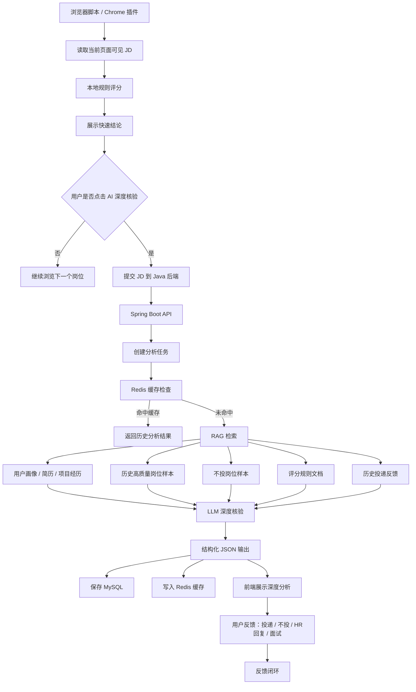

# AI 求职岗位筛选 Agent 平台架构设计

> 本文档是早期架构规划草稿，当前实现状态以 `README.md`、`docs/architecture.md`、`docs/api_reference.md` 为准。

> 当前文档用于后续在 GitHub 新分支中启动 AI Agent 项目改造。  
> 项目定位：**Java Spring Boot 后端为主体，浏览器脚本作为真实使用入口，结合规则引擎 + RAG + LLM 深度核验 + 投递反馈闭环，构建面向 Java 后端 / AI 应用 / Agent 岗位的智能求职筛选 Agent。**

---

## 1. 项目背景

当前已有功能：

- 浏览器端脚本读取 BOSS 当前页面可见岗位信息。
- 本地规则快速评分。
- 判断岗位方向：Java 后端、AI 应用后端、客户端、.NET/C#、GIS/遥感、测试/实施等。
- 输出：分数、结论、风险点、Excel 档位、复制分析结果。

当前功能优点：

- 响应快，几乎实时。
- 不依赖大模型。
- 成本低。
- 合规边界清晰：只读页面可见 DOM，不访问非公开接口，不自动投递，不自动发消息。

当前功能不足：

- 规则评分只能做初筛，无法深入结合用户简历和项目经历。
- 边界岗位需要人工判断，例如 AI 应用后端、大厂非主线岗位、JD 简略岗位。
- 不能根据历史投递反馈动态沉淀经验。
- 不能输出个性化面试准备点和打招呼话术。

因此，下一阶段目标不是替换规则评分，而是在规则评分基础上增加：

```text
AI 深度核验 + RAG 用户画像 + 投递闭环
```

---

## 2. 项目定位

### 2.1 项目名称

可选名称：

```text
AI Job Screening Agent
AI 求职岗位筛选 Agent 平台
Java / AI 应用实习岗位智能筛选助手
```

### 2.2 一句话介绍

基于 Java Spring Boot、Redis、MySQL、RAG 和大模型接口，构建面向 Java 后端 / AI 应用 / Agent 岗位的智能岗位筛选 Agent。浏览器脚本负责读取当前页面可见 JD 并进行低延迟规则评分，后端结合用户画像、项目经历、历史投递记录和岗位样本进行 AI 深度核验，输出结构化投递建议、风险点、简历匹配点、面试准备方向和打招呼话术。

### 2.3 项目类型

该项目不应被包装成普通油猴脚本项目，而应定位为：

```text
Java 后端 + AI 应用开发 + Agent 工程化项目
```

脚本只是入口，核心能力在 Java 后端。

---

## 3. 核心设计原则

### 3.1 快慢双链路

不能用 AI 替代当前规则评分。

正确设计：

```text
第一层：本地规则评分，毫秒级响应，用于高频刷岗位初筛。
第二层：AI 深度核验，用户主动点击后触发，用于边界岗位深度分析。
```

原因：

- 用户刷岗位是高频场景，AI 每次实时分析会慢。
- 大模型调用成本高，不适合每个岗位自动调用。
- 大模型输出不稳定，需要规则和结构化约束兜底。
- 只有用户主动点击“AI 深度核验”时才调用后端，更符合产品体验和合规边界。

### 3.2 人机协同

该 Agent 不是自动替用户投递，而是辅助用户判断。

边界：

- 不自动投递。
- 不自动发消息。
- 不绕验证码。
- 不访问 BOSS 非公开接口。
- 不读取 Cookie / Token。
- 只分析用户主动查看并触发核验的岗位。
- 最终是否投递由用户人工确认。

### 3.3 可解释决策

每次分析都要输出：

- 为什么建议投。
- 为什么建议不投。
- 哪些技术栈匹配。
- 哪些风险点触发。
- 和用户简历哪些项目匹配。
- 面试可能问什么。

不要只返回一句“这个岗位比较适合你”。

---

## 4. 总体架构



---

## 5. 技术栈规划

### 5.1 浏览器端

```text
Tampermonkey 油猴脚本 / 后续可升级 Chrome 插件
JavaScript / TypeScript
```

职责：

- 读取当前页面可见岗位详情。
- 本地规则快速评分。
- 展示右下角岗位匹配度面板。
- 提供“AI 深度核验”按钮。
- 将当前 JD、规则评分结果、岗位基础信息发送到后端。
- 展示后端返回的深度分析结果。

### 5.2 后端

```text
Java 17 / 21
Spring Boot 3.5.x
MySQL
Redis
Spring AI 或自定义 LLM Client
Embedding 模型
RAG 检索
异步任务
```

职责：

- 接收岗位分析请求。
- 创建 AI 分析任务。
- 管理任务状态。
- 进行缓存命中判断。
- 执行 RAG 检索。
- 调用大模型。
- 解析并校验结构化 JSON。
- 保存岗位记录、分析结果、用户反馈。

### 5.3 模型层

可选：

```text
Chat Model：DeepSeek / 通义千问 / OpenAI API / 本地模型
Embedding Model：text-embedding-v4 / bge-m3 / 其他向量模型
```

要求：

- LLM 输出必须结构化。
- Prompt 需要版本管理。
- 分析结果要可落库。
- 模型调用要有超时、重试、失败兜底。

---

## 6. 核心模块设计

### 6.1 Browser Script Module

文件示例：

```text
userscripts/job-chat-status-export.user.js
```

核心功能：

- `extractJobInfoFromDetail()`：抽取岗位标题、薪资、城市、经验、学历、出勤周期、JD 文本。
- `scoreJob()`：本地规则评分。
- `renderJobFitPanel()`：渲染本地评分面板。
- `requestAiDeepAnalysis()`：用户点击按钮后请求后端。
- `renderAiAnalysisResult()`：展示 AI 深度分析结果。

新增按钮：

```text
AI 深度核验
```

按钮行为：

1. 收集当前岗位 JD。
2. 带上本地规则评分结果。
3. 调用后端 `POST /api/job/analyze`。
4. 显示“分析中”。
5. 轮询 `GET /api/job/analyze/{taskId}`。
6. 展示结果。

---

### 6.2 Rule Engine Module

规则引擎可以先保留在脚本端，也可以后续同步到后端。

职责：

- Java 后端岗位识别。
- AI 应用后端岗位识别。
- 非主线方向识别。
- 社招经验识别。
- 出勤周期风险识别。
- 12 个月 / 7 天每周等硬性风险识别。

规则输出：

```json
{
  "ruleScore": 76,
  "direction": "Java后端 + AI应用",
  "conclusion": "可投",
  "grade": "B档-可投",
  "matchedKeywords": ["Java", "Spring Boot", "MySQL", "Redis", "RAG"],
  "riskFlags": ["JD略泛"]
}
```

---

### 6.3 AI Analysis Task Module

后端 AI 分析不应同步阻塞主流程，建议使用任务模式。

任务状态：

```text
PENDING     待处理
RUNNING     分析中
SUCCESS     分析成功
FAILED      分析失败
CACHED      命中缓存
```

流程：

1. 接收岗位分析请求。
2. 计算 `jobTextHash`。
3. 检查 Redis 是否已有分析结果。
4. 未命中则创建任务。
5. 异步执行 RAG + LLM。
6. 写入 MySQL 和 Redis。
7. 前端轮询任务状态。

---

### 6.4 RAG Module

RAG 不是用来查百科，而是用来查用户上下文。

知识来源：

```text
1. 用户简历
2. 用户项目经历
3. 用户目标岗位方向
4. 高质量岗位样本
5. 不投岗位样本
6. 历史投递记录
7. HR 回复和面试反馈
8. 评分规则说明
9. 常见岗位风险样本
10. 面试题库 / 八股准备点
```

检索目标：

- 找出当前岗位和用户项目的匹配点。
- 找出类似岗位历史判断。
- 找出是否存在伪后端、测试、实施、客户端等风险。
- 找出应该准备的面试知识点。

---

### 6.5 LLM Decision Module

LLM 负责深度核验，不负责无脑替代规则。

输入：

```text
岗位 JD
本地规则评分结果
用户画像
简历项目经历
RAG 检索结果
历史岗位样本
评分规则说明
```

输出必须是结构化 JSON：

```json
{
  "finalDecision": "可投",
  "finalScore": 78,
  "excelGrade": "B档-可投",
  "direction": "Java后端 + AI应用",
  "summary": "该岗位技术栈与 Java 后端和 AI 应用方向较匹配，适合作为主力投递岗位。",
  "reasons": [
    "岗位要求 Java / Spring Boot / MySQL / Redis，与后端主线匹配。",
    "JD 中出现 AI 应用接口和大模型相关内容，与用户 Agent 项目经历相关。"
  ],
  "risks": [
    "JD 对具体业务描述较少，需要面试中确认实际工作内容。"
  ],
  "resumeMatches": [
    "黑马点评 Redis 项目",
    "AI Agent RAG 项目",
    "Tool Calling 项目"
  ],
  "interviewFocus": [
    "Redis 缓存一致性",
    "Spring 事务失效场景",
    "RAG 检索流程",
    "大模型接口调用与限流"
  ],
  "suggestedMessage": "您好，我目前主要准备 Java 后端和 AI 应用开发方向，做过 Redis 项目和 RAG/Agent 项目，看到岗位技术栈比较匹配，希望有机会进一步沟通。"
}
```

---

### 6.6 Feedback Loop Module

用户反馈用于沉淀样本，不一定做自动学习，第一版先做数据闭环。

反馈类型：

```text
已投递
未投递
HR 已读未回
HR 回复
约面试
面试通过
面试未过
岗位不合适
误判：脚本高估
误判：脚本低估
```

价值：

- 后续优化规则评分。
- 形成高质量岗位样本库。
- 形成不投岗位样本库。
- 面试时可以讲“我不是只做 Demo，而是设计了反馈闭环”。

---

## 7. 后端 API 设计

### 7.1 创建 AI 深度分析任务

```http
POST /api/job/analyze
```

请求示例：

```json
{
  "source": "boss_visible_dom",
  "jobTitle": "AI 应用开发后端实习生",
  "companyName": "某公司",
  "city": "北京",
  "salary": "200-300元/天",
  "schedule": "4天/周",
  "duration": "3个月",
  "jobText": "完整 JD 文本...",
  "localRuleResult": {
    "ruleScore": 77,
    "conclusion": "可投",
    "direction": "Java后端 + AI应用",
    "riskFlags": []
  }
}
```

响应示例：

```json
{
  "taskId": 10001,
  "status": "PENDING",
  "cached": false
}
```

---

### 7.2 查询分析任务结果

```http
GET /api/job/analyze/{taskId}
```

响应示例：

```json
{
  "taskId": 10001,
  "status": "SUCCESS",
  "result": {
    "finalDecision": "可投",
    "finalScore": 78,
    "direction": "Java后端 + AI应用",
    "risks": ["JD略泛"],
    "resumeMatches": ["AI Agent RAG 项目", "Redis 项目"],
    "interviewFocus": ["Spring Boot", "Redis", "RAG", "接口设计"],
    "suggestedMessage": "您好，我目前主要准备 Java 后端和 AI 应用开发方向..."
  }
}
```

---

### 7.3 提交用户反馈

```http
POST /api/job/feedback
```

请求示例：

```json
{
  "jobId": 20001,
  "taskId": 10001,
  "action": "APPLIED",
  "userLabel": "B档-可投",
  "note": "已投递，等待回复"
}
```

---

### 7.4 用户画像管理

```http
POST /api/profile
GET /api/profile
```

用户画像内容：

```json
{
  "targetDirections": ["Java后端", "AI应用开发", "Agent工程化"],
  "skills": ["Java", "Spring Boot", "MySQL", "Redis", "RAG", "Tool Calling"],
  "projects": ["黑马点评", "AI Agent RAG 项目", "NPU 推理管理平台"],
  "preferredCities": ["北京", "天津"],
  "avoidDirections": ["测试", "实施", "客户端", ".NET", "GIS"]
}
```

---

## 8. 数据库表设计草案

### 8.1 job_posting

保存岗位基础信息。

```sql
CREATE TABLE job_posting (
    id BIGINT PRIMARY KEY AUTO_INCREMENT,
    source VARCHAR(64),
    job_title VARCHAR(255),
    company_name VARCHAR(255),
    city VARCHAR(64),
    salary VARCHAR(64),
    schedule VARCHAR(64),
    duration VARCHAR(64),
    job_text_hash VARCHAR(64),
    job_text MEDIUMTEXT,
    created_at DATETIME,
    updated_at DATETIME
);
```

### 8.2 local_rule_score

保存本地规则评分结果。

```sql
CREATE TABLE local_rule_score (
    id BIGINT PRIMARY KEY AUTO_INCREMENT,
    job_id BIGINT,
    rule_score INT,
    conclusion VARCHAR(64),
    excel_grade VARCHAR(64),
    direction VARCHAR(128),
    matched_keywords TEXT,
    risk_flags TEXT,
    rule_version VARCHAR(64),
    created_at DATETIME
);
```

### 8.3 ai_analysis_task

保存 AI 分析任务。

```sql
CREATE TABLE ai_analysis_task (
    id BIGINT PRIMARY KEY AUTO_INCREMENT,
    job_id BIGINT,
    status VARCHAR(32),
    cache_key VARCHAR(128),
    model_name VARCHAR(128),
    prompt_version VARCHAR(64),
    error_message TEXT,
    created_at DATETIME,
    updated_at DATETIME
);
```

### 8.4 ai_analysis_result

保存 AI 深度核验结果。

```sql
CREATE TABLE ai_analysis_result (
    id BIGINT PRIMARY KEY AUTO_INCREMENT,
    task_id BIGINT,
    job_id BIGINT,
    final_decision VARCHAR(64),
    final_score INT,
    excel_grade VARCHAR(64),
    direction VARCHAR(128),
    summary TEXT,
    reasons TEXT,
    risks TEXT,
    resume_matches TEXT,
    interview_focus TEXT,
    suggested_message TEXT,
    raw_json MEDIUMTEXT,
    created_at DATETIME
);
```

### 8.5 user_profile

保存用户画像。

```sql
CREATE TABLE user_profile (
    id BIGINT PRIMARY KEY AUTO_INCREMENT,
    name VARCHAR(64),
    target_directions TEXT,
    skills TEXT,
    projects TEXT,
    preferred_cities TEXT,
    avoid_directions TEXT,
    profile_version VARCHAR(64),
    created_at DATETIME,
    updated_at DATETIME
);
```

### 8.6 job_feedback

保存投递反馈。

```sql
CREATE TABLE job_feedback (
    id BIGINT PRIMARY KEY AUTO_INCREMENT,
    job_id BIGINT,
    task_id BIGINT,
    action VARCHAR(64),
    user_label VARCHAR(64),
    note TEXT,
    created_at DATETIME
);
```

---

## 9. Redis 缓存设计

### 9.1 AI 分析结果缓存

缓存 Key：

```text
job:analysis:{jobTextHash}:{profileVersion}:{ruleVersion}:{promptVersion}
```

缓存 Value：

```json
{
  "finalDecision": "可投",
  "finalScore": 78,
  "direction": "Java后端 + AI应用",
  "risks": ["JD略泛"],
  "resumeMatches": ["AI Agent RAG 项目"]
}
```

### 9.2 限流

防止用户短时间频繁点击 AI 核验：

```text
rate:ai-analysis:{userId}:{yyyyMMddHHmm}
```

### 9.3 任务状态缓存

```text
task:ai-analysis:{taskId}
```

---

## 10. Agent 体现在哪里

面试时不能只说“我调用了大模型”。

这个项目的 Agent 体现在：

```text
1. 感知：从浏览器当前页面读取岗位 JD。
2. 结构化：抽取岗位标题、薪资、城市、经验、学历、出勤周期和技术栈。
3. 规则判断：先用规则引擎做低延迟初筛。
4. 记忆：通过用户画像、历史投递记录、岗位样本和反馈形成长期上下文。
5. 检索：通过 RAG 找出和当前岗位相关的用户项目、历史样本和评分规则。
6. 决策：调用 LLM 输出投 / 不投 / 谨慎投以及原因。
7. 行动建议：生成打招呼话术和面试准备点。
8. 人工确认：最终由用户决定是否投递，形成 Human-in-the-loop。
9. 反馈闭环：用户反馈投递结果，反向沉淀样本。
```

因此它是一个人机协同的岗位筛选决策 Agent，而不是普通聊天机器人。

---

## 11. 和普通 RAG Demo 的区别

普通 RAG Demo：

```text
上传文档 → 用户提问 → 大模型回答
```

本项目：

```text
当前岗位 JD → 规则初筛 → 用户主动 AI 核验 → RAG 检索用户画像和历史样本 → LLM 结构化决策 → 投递反馈闭环
```

差异：

- 有真实业务场景。
- 有快慢链路设计。
- 有规则引擎兜底。
- 有结构化输出。
- 有缓存和异步任务。
- 有用户反馈闭环。
- 有合规边界。

---

## 12. 分支规划

当前已有分支：

```text
main                         稳定主线
backup/pre-job-fit-scoring   加评分功能前的备份
feature/job-fit-scoring      岗位评分功能实验分支
```

建议新增 AI Agent 分支：

```text
feature/ai-job-screening-agent
```

如果 AI Agent 功能依赖当前评分面板，建议从 `feature/job-fit-scoring` 创建新分支：

```bash
git switch feature/job-fit-scoring
git pull
git switch -c feature/ai-job-screening-agent
git push -u origin feature/ai-job-screening-agent
```

如果想从干净主线重新做后端，可以从 `main` 创建：

```bash
git switch main
git pull
git switch -c feature/ai-job-screening-agent
git push -u origin feature/ai-job-screening-agent
```

推荐选择：

```text
从 feature/job-fit-scoring 创建，因为 AI 深度核验需要复用当前评分面板和 JD 读取能力。
```

---

## 13. 目录结构建议

```text
ai-job-application-tracker-toolkit/
├─ README.md
├─ userscripts/
│  └─ job-chat-status-export.user.js
├─ backend/
│  ├─ pom.xml
│  └─ src/
│     ├─ main/
│     │  ├─ java/
│     │  │  └─ com/example/jobagent/
│     │  │     ├─ JobAgentApplication.java
│     │  │     ├─ controller/
│     │  │     │  ├─ JobAnalyzeController.java
│     │  │     │  ├─ ProfileController.java
│     │  │     │  └─ FeedbackController.java
│     │  │     ├─ service/
│     │  │     │  ├─ JobAnalyzeService.java
│     │  │     │  ├─ AiAnalysisTaskService.java
│     │  │     │  ├─ RagService.java
│     │  │     │  ├─ LlmClient.java
│     │  │     │  ├─ RuleScoreService.java
│     │  │     │  └─ FeedbackService.java
│     │  │     ├─ domain/
│     │  │     │  ├─ JobPosting.java
│     │  │     │  ├─ LocalRuleScore.java
│     │  │     │  ├─ AiAnalysisTask.java
│     │  │     │  ├─ AiAnalysisResult.java
│     │  │     │  ├─ UserProfile.java
│     │  │     │  └─ JobFeedback.java
│     │  │     ├─ mapper/
│     │  │     ├─ dto/
│     │  │     ├─ config/
│     │  │     └─ common/
│     │  └─ resources/
│     │     ├─ application.yml
│     │     └─ mapper/
│     └─ test/
├─ docs/
│  ├─ ai_agent_architecture.md
│  ├─ compliance_boundary.md
│  ├─ scoring_rules.md
│  └─ prompt_versions.md
├─ prompts/
│  ├─ job_deep_analysis_prompt.md
│  └─ job_json_schema.md
└─ sql/
   └─ init_job_agent.sql
```

---

## 14. 版本路线

### v0.1：保留规则评分

目标：稳定当前脚本。

功能：

- 本地规则评分。
- 风险点展示。
- Excel 档位。
- 复制岗位分析。

状态：当前已基本完成。

---

### v0.2：AI 深度核验接口

目标：把 AI 能力接入后端。

功能：

- 新增 Spring Boot 后端。
- 新增 `POST /api/job/analyze`。
- 用户点击按钮后提交 JD。
- 后端调用 LLM 返回结构化结果。
- 前端展示结果。

暂时可以不做完整 RAG，先把链路打通。

---

### v0.3：异步任务 + 缓存

目标：解决 AI 慢和重复调用问题。

功能：

- AI 分析任务状态。
- 前端轮询。
- Redis 缓存。
- Redis 限流。
- 失败重试和兜底结果。

---

### v0.4：用户画像 + RAG

目标：让分析结果真正个性化。

功能：

- 用户画像管理。
- 简历 / 项目经历入库。
- 岗位样本入库。
- Embedding 向量化。
- RAG 检索。
- 基于检索结果生成个性化建议。

---

### v0.5：投递反馈闭环

目标：让项目从 Demo 变成真实系统。

功能：

- 保存投递记录。
- 保存 HR 回复状态。
- 保存面试反馈。
- 标记脚本误判：高估 / 低估。
- 沉淀高质量岗位样本和不投岗位样本。

---

### v0.6：面试展示增强

目标：提升项目可讲性。

功能：

- 分析日志。
- Prompt 版本管理。
- 模型调用耗时统计。
- 缓存命中率统计。
- 规则评分和 AI 核验差异对比。
- 100 条岗位样本评测。

---

## 15. 面试可讲亮点

### 15.1 快慢双引擎

```text
我没有直接让大模型判断所有岗位，而是设计了规则评分 + AI 深度核验的双层架构。规则评分负责低延迟初筛，大模型只处理用户主动触发的边界岗位，兼顾响应速度、成本和稳定性。
```

### 15.2 个性化 RAG

```text
项目中的 RAG 不是普通文档问答，而是检索用户简历、项目经历、历史投递反馈和岗位样本，用于判断当前岗位和用户背景的匹配度。
```

### 15.3 结构化输出

```text
大模型返回结果必须符合 JSON Schema，包括最终决策、分数、风险点、简历匹配点、面试准备点和开场白，方便前端稳定展示和后续数据分析。
```

### 15.4 异步任务和缓存

```text
考虑到大模型调用较慢，我把深度核验设计成异步任务，并用 Redis 基于 JD Hash、用户画像版本和 Prompt 版本做缓存，避免重复调用模型。
```

### 15.5 反馈闭环

```text
用户可以记录投递、HR 回复和面试结果，系统将这些反馈沉淀为岗位样本，用于后续优化规则和 RAG 检索。
```

---

## 16. 简历描述草案

### 项目名称

```text
AI 求职岗位筛选 Agent 平台
```

### 项目描述

```text
基于 Java Spring Boot、Redis、MySQL、RAG 和大模型接口，设计并实现面向 Java 后端 / AI 应用岗位的智能岗位筛选 Agent。系统通过浏览器脚本读取当前页面可见 JD，先使用本地规则引擎进行低延迟初筛，再由用户主动触发 AI 深度核验；后端结合用户简历、项目经历、历史投递记录和岗位样本进行 RAG 检索，输出结构化投递建议、风险点、简历匹配点、面试准备方向和打招呼话术。系统支持岗位记录管理、AI 分析任务、Redis 缓存、Prompt 版本管理和投递反馈闭环。
```

### 项目亮点

```text
1. 设计规则评分 + LLM 深度核验的双层决策架构，解决高频岗位浏览场景下大模型响应慢、成本高的问题。
2. 基于 RAG 检索用户画像、项目经历、历史岗位样本和评分规则，提高岗位判断的个性化程度。
3. 使用 Redis 实现 JD 分析结果缓存和 AI 调用限流，降低重复模型调用成本。
4. 通过 JSON Schema 约束大模型输出，支持前端稳定展示投递建议、风险点、简历匹配点和面试准备方向。
5. 设计投递反馈闭环，记录 HR 回复、面试结果和误判样本，用于后续优化规则评分和岗位样本库。
```

---

## 17. 合规边界说明

本项目必须坚持以下边界：

```text
1. 只读取当前浏览器页面已经展示出来的岗位文本。
2. 不访问招聘平台非公开接口。
3. 不绕过验证码、登录校验或风控机制。
4. 不自动批量抓取岗位。
5. 不自动投递简历。
6. 不自动发送 HR 消息。
7. 不读取 Cookie、Token 或其他敏感凭证。
8. AI 分析必须由用户主动触发。
9. 最终是否投递由用户人工决定。
```

对外表述建议：

```text
这是一个个人求职辅助工具，用于帮助用户理解当前页面可见岗位 JD 和判断岗位匹配度，不替代用户决策，也不执行自动投递或自动沟通。
```

---

## 18. 当前最推荐的下一步

不要一开始就做大而全。

建议第一阶段只做：

```text
1. 从 feature/job-fit-scoring 创建 feature/ai-job-screening-agent 分支。
2. 新增 backend/ Spring Boot 项目。
3. 实现 POST /api/job/analyze。
4. 先不做复杂 RAG，先让用户点击按钮后能得到结构化 AI 深度分析。
5. 再加入 Redis 缓存和异步任务。
6. 最后再接用户画像和 RAG。
```

第一阶段完成标准：

```text
浏览器脚本能把当前岗位 JD 发给 Java 后端；
Java 后端能返回结构化投递建议；
前端能展示 AI 深度核验结果；
整个链路能跑通。
```

做到这里，项目就已经从规则脚本升级为 Java AI 应用项目。

---

## 19. 最终判断

这个项目如果只做成“油猴脚本 + 调一次大模型”，含金量一般，容易像玩具。

但如果按本文架构做成：

```text
浏览器入口 + 规则引擎 + Java 后端 + 异步任务 + Redis 缓存 + RAG 用户画像 + LLM 结构化决策 + 投递反馈闭环
```

它就不是玩具，而是一个真实场景下的 AI Agent 工程化项目，适合用于：

```text
Java 后端实习
AI 应用开发实习
Agent 工程化实习
```

不适合作为：

```text
GPU 推理工程师
AI Infra
模型训练 / 推理加速方向
```

一句话总结：

```text
规则评分负责快，AI Agent 负责深；脚本负责入口，Java 后端负责核心；用户人工确认负责最终决策。
```
