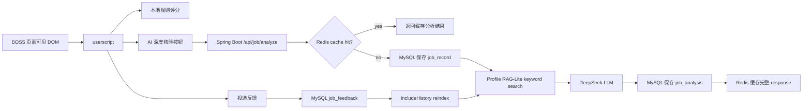

# Architecture

本文档说明 AI Job Screening Agent / BOSS 求职 Agent 的当前架构。项目定位是个人求职跟进辅助工具：前端用户脚本读取当前页面可见 DOM 文本，后端负责 AI 深度核验、缓存、落库、画像检索和历史反馈闭环。

## 总体链路

## userscript 层

userscript 运行在浏览器页面中，负责：

- 读取当前右侧岗位详情区域中的可见文本。
- 抽取 jobTitle、companyName、salary、city、schedule、duration 等字段。
- 在页面右下角展示岗位规则评分面板。
- 主动点击后调用本地后端 `/api/job/analyze`。
- 展示 AI 深度核验结果、profileRag 画像命中证据、历史记录和投递反馈表单。
- 保留聊天列表 TSV 导出功能。

userscript 不自动调用 AI，不自动投递，不自动发送消息，不读取 Cookie / Token，不访问 BOSS 非公开接口。

## Spring Boot 后端层

后端负责把前端传来的岗位信息转成可追踪的数据闭环：

- `JobAnalysisService`：岗位 AI 深度核验主流程。
- `LlmClient`：DeepSeek OpenAI-compatible API 调用。
- `JobAnalysisCacheService`：Redis 分析结果缓存。
- `JobRecordRepository` / history repository：岗位记录、分析结果和历史查询。
- `JobFeedbackRepository`：投递反馈保存和查询。
- `UserProfileService`：默认用户画像保存与查询。
- `UserScoringConfigService`：AI 辅助生成并确认评分配置。
- `UserProfileRagService`：用户画像和历史反馈的 RAG-Lite reindex/search。
- `JobFieldSanitizer`：保存前兜底清洗 companyName、jobTitle 等字段。

## MySQL 数据层

MySQL 负责长期沉淀，不承担实时推理：

- `job_record`：岗位原始字段和规则评分。
- `job_analysis`：AI 决策、分数、方向、理由、风险和建议话术。
- `job_feedback`：用户后续投递、沟通、面试和放弃原因。
- `user_profile`：默认用户画像。
- `user_scoring_config`：AI 生成并确认的评分配置。
- `user_profile_document`：RAG-Lite 文档。
- `user_profile_chunk`：RAG-Lite 检索 chunk。

MySQL 是项目的长期记忆层；即使 Redis 过期，历史记录和反馈仍可保留。

## Redis 缓存层

Redis 缓存的是岗位分析 response，不是用户画像本身。

缓存 key 由两部分组成：

- `profileVersion`：当前用户画像文档的内容版本。
- `jobHash`：岗位请求字段的稳定 hash。

这样同一岗位在同一画像版本下可以直接复用分析结果；用户画像 reindex 后，profileVersion 变化，相同岗位可以重新生成更贴近新画像的分析。

## DeepSeek LLM 层

DeepSeek 只在用户主动点击“AI 深度核验”后、且 Redis 未命中时调用。Prompt 中包含：

- 岗位基础信息。
- userscript 本地规则评分和规则结论。
- Profile RAG-Lite 检索到的用户画像资料。
- 输出 JSON 字段约束。

如果 LLM 未启用、API Key 为空、调用失败或 JSON 解析失败，后端会 fallback，避免接口直接 500。

## Profile RAG-Lite 层

RAG-Lite 当前使用关键词检索，不使用 embedding，不使用向量数据库。

数据来源包括：

- 手动用户画像。
- AI 生成评分配置。
- 历史岗位分析。
- 投递反馈。

`POST /api/profile/reindex` 会按 profileName 幂等重建：先删除旧 chunk，再删除旧 document，然后重建新的 document 和 chunks。`includeHistory=true` 时会把历史分析和反馈也纳入检索资料，并对历史 companyName/jobTitle 做清洗。

## 历史反馈闭环

用户在页面保存投递反馈后，反馈进入 `job_feedback`。当执行 `POST /api/profile/reindex?includeHistory=true` 时，后端会把历史分析和反馈整理为 chunk。后续 AI 深度核验时，这些 chunk 可能被 profileRag 命中，从而让 AI 能参考过去的投递经验和放弃原因。

## 为什么普通评分不走 RAG

普通评分发生在页面实时浏览阶段，需要快速、稳定、可解释。它只依赖本地规则和已加载的 scoring config，不实时请求后端 RAG。

AI 深度核验是用户主动触发的重分析动作，允许更高延迟，因此适合检索用户画像、拼 Prompt、调用 LLM。

## 为什么 Redis 缓存岗位分析结果而不是用户画像

用户画像保存在 MySQL，并通过 reindex 生成 RAG-Lite document/chunk。Redis 只缓存最终岗位分析 response，用于避免同一岗位重复调用 LLM 和重复落库。画像变化通过 profileVersion 进入缓存 key，而不是把画像本体放进 Redis。

## 为什么第一版 RAG-Lite 不上向量库

当前用户画像规模很小，数据主要是技能、项目、偏好、历史反馈和关键词。关键词检索足够轻量，也方便调试和演示。后续如果画像数据变多，再考虑 embedding、向量库和 rerank。

## 合规边界

- 只读取当前页面可见 DOM 文本。
- 不读取 Cookie / Token。
- 不访问 BOSS 非公开接口。
- 不绕过验证码或登录校验。
- 不自动投递。
- 不自动发送消息。
- 最终是否投递由用户人工决定。
