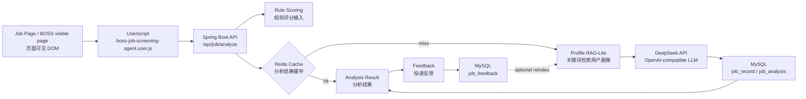

# Architecture（系统架构）

本文档说明 `ai-job-screening-agent` 当前实现的系统结构。项目定位是 local-first、compliance-aware 的个人岗位筛选辅助工具，不是自动化爬虫系统，也不是复杂多 Agent 平台。

## Overall Flow（整体链路）

## Userscript Layer（浏览器脚本层）

Userscript 运行在用户主动打开的岗位页面中，负责读取当前页面可见 DOM 文本，提取岗位字段，展示规则评分面板，并在用户手动点击后调用本地后端接口。

脚本文件：`userscripts/boss-job-screening-agent.user.js`

边界：不读取 Cookie / Token，不访问招聘平台非公开 API，不自动投递，不自动发送消息，不绕过验证码或反爬机制。

## Spring Boot Layer（后端服务层）

后端位于 `backend/`，基于 Spring Boot 3 和 Java 17。主要职责：

- `JobAnalysisService`：岗位分析主流程，包含缓存检查、记录保存、Profile RAG-Lite 检索、LLM 调用和 fallback。
- `OpenAiCompatibleLlmClient`：调用 DeepSeek OpenAI-compatible API。
- `JobAnalysisCacheService`：使用 Redis 缓存岗位分析结果。
- `JobRecordRepository` / `JobHistoryRepository`：保存与查询岗位记录、分析结果和历史记录。
- `JobFeedbackRepository`：保存投递反馈。
- `UserProfileRagService`：构建和检索 RAG-Lite chunk。

## Data Layer（数据层）

MySQL 负责持久化：

- `job_record`：岗位基础字段和规则评分。
- `job_analysis`：AI 分析结果。
- `job_feedback`：用户投递反馈。
- `user_profile`：默认用户画像。
- `user_scoring_config`：用户评分配置。
- `user_profile_document` / `user_profile_chunk`：RAG-Lite 文档和 chunk。

Redis 只缓存岗位分析 response，不保存用户画像本体。缓存 key 会包含 profileVersion，用户画像 reindex 后可自然区分旧缓存。

## RAG-Lite Layer（轻量检索增强层）

当前 RAG-Lite 使用关键词命中，不使用向量数据库、Embedding rerank、Milvus、Chroma 或 Redis Vector。它适合当前用户画像规模小、字段清晰、需要可解释命中证据的场景。

## Tool Calling Boundary（工具调用边界）

本项目的 Tool Calling 是轻量 Tool Calling 风格：把岗位查询、画像查询、历史查询和反馈保存等后端能力作为 AI 分析流程可调用的业务工具。当前没有模型自主规划多步骤任务，也没有复杂多 Agent 编排。

## Compliance Boundary（合规边界）

- 只读取当前页面可见 DOM。
- 不读取 Cookie / Token。
- 不访问招聘平台非公开 API。
- 不自动投递或自动发送消息。
- 不绕过验证码或反爬机制。
- 不做批量爬取。
